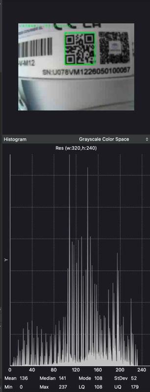
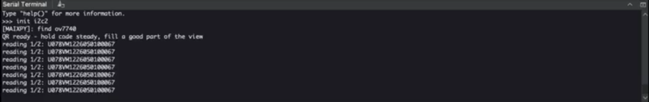

# Offline QR Scanning Node for M5Stack UnitV K210

An on-device QR scanning application for the **M5Stack UnitV K210** (OV7740, M12).  
The system captures frames, decodes QR payloads, applies validation logic, and writes an offline audit log to internal flash — without cloud services or network connectivity.

[Demo videos](https://adilzahoor2812.github.io/unitv-qr-scanner/) · [Source (`main.py`)](main.py) · [License](LICENSE)

---

## Overview

This project treats the UnitV as a compact **edge vision node** rather than a host-dependent accessory. After firmware setup, the same script can run in MaixPy IDE for development or boot automatically from flash for standalone deployment on USB power.

**Primary use cases**
- Inventory / asset tagging demos
- Offline check-in prototypes (lab, workshop, events)
- Embedded computer-vision coursework and portfolio work

---

## Features

| Capability | Implementation |
|---|---|
| On-device QR decode | MaixPy `image.find_qrcodes()` |
| False-accept reduction | Multi-frame stability lock |
| Range robustness | Minimum bounding-box size filter |
| Duplicate suppression | Time-based cooldown |
| Persistence | Append-only log at `/flash/scans.txt` |
| Standalone operation | Deploy as `/flash/main.py` |

---

## Demonstrations

| Demo | Description |
|---|---|
| [QR Scanner](https://adilzahoor2812.github.io/unitv-qr-scanner/) | Live detection with bounding box and payload overlay |
| [Serial output](https://adilzahoor2812.github.io/unitv-qr-scanner/) | Accepted scans printed to the host console |

[](https://adilzahoor2812.github.io/unitv-qr-scanner/)
[](https://adilzahoor2812.github.io/unitv-qr-scanner/)

---

## Architecture

```text
OV7740 capture
      │
      ▼
QR decode (largest detection)
      │
      ├─ size filter ──────────────► reject (too small / far)
      ├─ stability lock (N frames) ► reject (unstable)
      └─ cooldown check ───────────► suppress duplicate
      │
      ▼
Append event → /flash/scans.txt
Print confirmation on UART/USB console
```

**Development path:** USB-C ↔ MaixPy IDE (preview + serial)  
**Deployment path:** USB power only → auto-run `main.py`

---

## Technical stack

| Layer | Details |
|---|---|
| Hardware | [UnitV K210 M12](https://docs.m5stack.com/en/unit/UNIT-V%20M12), OV7740 sensor |
| Compute | Kendryte K210 (dual-core RISC-V) |
| Firmware / runtime | MaixPy (MicroPython) |
| Host tools | Kflash_GUI, MaixPy IDE (macOS) |
| Resolution | QVGA (320×240) |

---

## Getting started

### Requirements
- M5Stack UnitV K210 (OV7740)
- USB-C data cable
- MaixPy-compatible firmware for StickV/UnitV (full build recommended)
- MaixPy IDE

### 1. Flash firmware
1. Connect the UnitV over USB-C.
2. In **Kflash_GUI**, select board **M5StickV**.
3. Flash a full MaixPy StickV/UnitV image.
4. Power-cycle the device.

> Note: Minimal MaixPy builds may omit OpenMV QR APIs such as `find_qrcodes()`.

### 2. Run the application
1. Open MaixPy IDE → **Tools → Select Board → M5StickV**.
2. Connect to the serial port.
3. Open [`main.py`](main.py) and run it.
4. Present a high-contrast QR code at close range under stable lighting.

### 3. Read the audit log

```python
print(open("/flash/scans.txt").read())
```

### 4. Standalone deployment
Upload/save the script as `/flash/main.py` so scanning starts automatically on power-up.

---

## Log format

Each accepted scan is stored as:

```text
<timestamp_ms>,<payload>
```

Example:

```text
123456,HELLO-UNITV
128902,STU2026001
135440,TOOL-17
```

The payload is the exact QR content (identifier, URL, or custom string).

---

## Design constraints

| Constraint | Impact on design |
|---|---|
| QVGA + wide FOV | Codes must be relatively large in-frame |
| Limited on-device resources | Lightweight classical decode, not cloud OCR |
| No onboard Wi-Fi | Logging remains local unless a host bridge is added |
| Variable microSD compatibility | Default persistence uses internal flash |

---

## Repository structure

```text
├── main.py                 # Scanner application
├── LICENSE                 # MIT
├── qr-scanner.mp4          # Demo asset
├── serial-monitor.mp4
└── docs/                   # GitHub Pages demo player + posters
```

---

## Future work

- Mode switch (inventory vs check-in) via onboard buttons  
- UART JSON stream to ESP32/STM32 for networked gateways  
- AprilTag support for robotics alignment tasks  
- Optional TinyML classifier for scene context alongside QR  

---

## Author

**Adil Zahoor**  
M.Sc. Artificial Intelligence — Berlin  
Embedded systems · edge perception · sensor verification  

- GitHub: [adilzahoor2812](https://github.com/adilzahoor2812)  
- Project page: [Demo player](https://adilzahoor2812.github.io/unitv-qr-scanner/)

---

## License

Released under the [MIT License](LICENSE).
